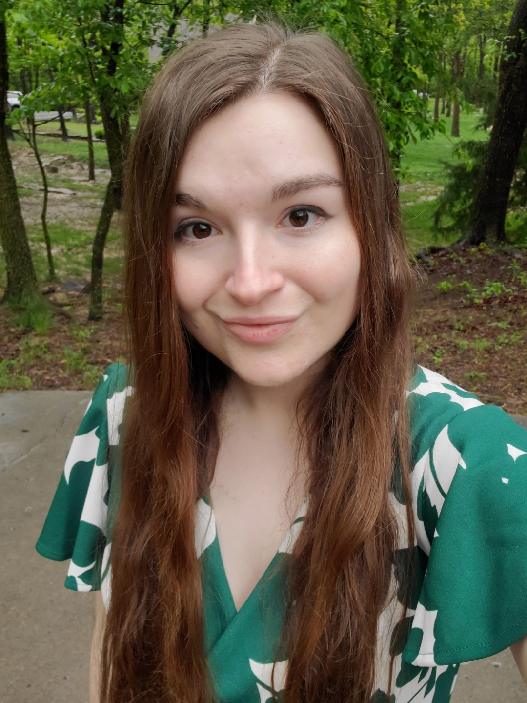

# Software Team
## Intern

Hello! My Name is Aramaea (air-uh-may-uh) and I am one of the software team interns working on the ATLAS detector project.
I am a senior working towards my bachelor's in Computer Science with aspirations to also get a Master's in Business Administration.
I am fascinated by how technoGlogy can both uncover the secrets of our world and solve human problems. My goal is to use what I
learn in college to better the lives of humanity, and discover more about what makes the world tick.
Our work aligns perfectly with my goals and passions. I am grateful for this opportunity and looking forward to seeing what our teams come up with. 
