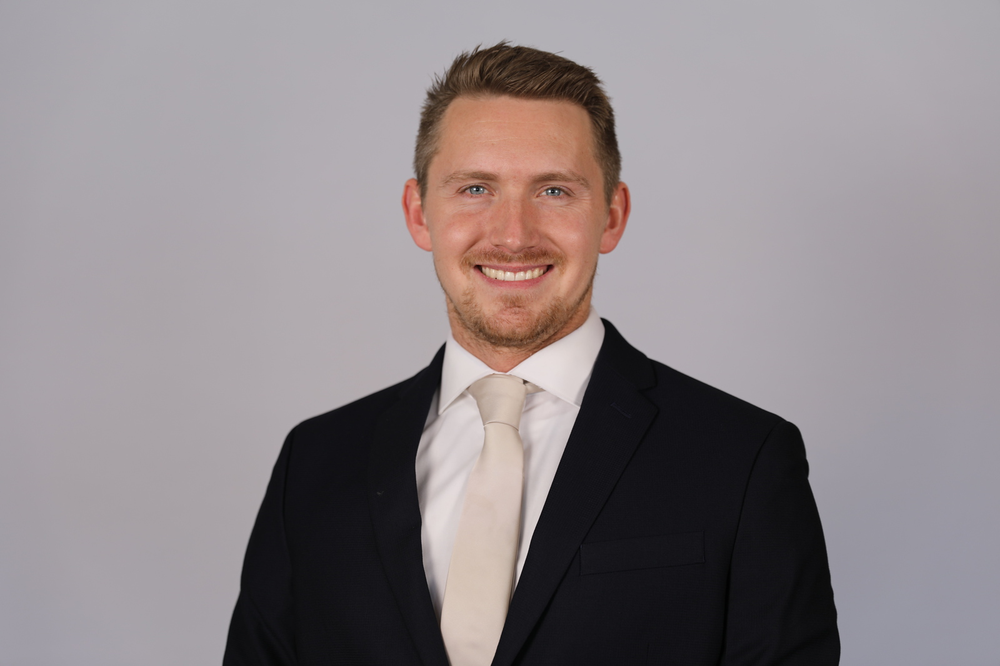

# software-onboarding
Onboarding project for new software team employees to practice basic git commands. 

I want you to clone this repo, make your own branch, add a professional photo and bio that we can use for the team, and commit your changes to the main branch. Assign me as the reviewer. If done correctly I'll merge the branches!

Add your photo into the `/assets` folder

# Software Team
## Manager

Hi! My name is Dr. Jacob E. Crosby. I am currently the manager of the Software Team at the OSU High Energy Physics Hardware Development Lab. I graduate from OSU with my PhD in High Energy Physics. The title of my dissertation is"SEARCHES FOR NEW PHYSICS USING UNSUPERVISED MACHINE LEARNING FOR ANOMALY DETECTION AT THE ATLAS DETECTOR AND THE DEVELOPMENT OF PARTICLE IDENTIFICATION ALGORITHMS FOR THE HL-LHC". I currently live in Michigan with my wife and a beautiful baby boy. Which means I work 100% remote!

## Research Software Engineer

## Intern

Hello! My Name is Aramaea (air-uh-may-uh) and I am one of the software team interns working on the ATLAS detector project.
I am a senior working towards my bachelor's in Computer Science with aspirations to also get a Master's in Business Administration.
I am fascinated by how technoGlogy can both uncover the secrets of our world and solve human problems. My goal is to use what I
learn in college to better the lives of humanity, and discover more about what makes the world tick.
Our work aligns perfectly with my goals and passions. I am grateful for this opportunity and looking forward to seeing what our teams come up with. 

## UI and Machine Learning